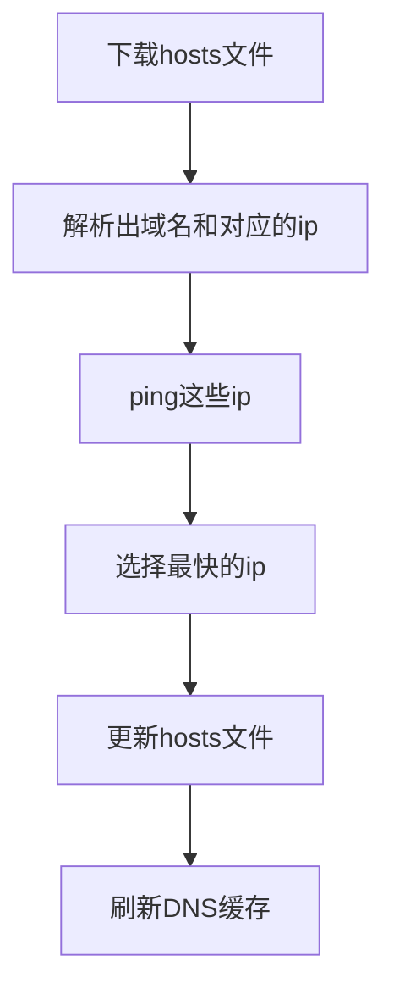

# Update Hosts File for Windows

Only needed for Windows users in China.
[Chinese Documentation](https://www.windtunnel.cn/posts/rust/update-hosts/)

程序的功能很简单，就是下载hosts文件，然后解析出域名和对应的ip，然后ping这些ip，选择最快的ip，然后更新hosts文件。

稍微好玩一点就是有：下载hosts文件、ping每个域名对应的多个ip选择最快的一个。
